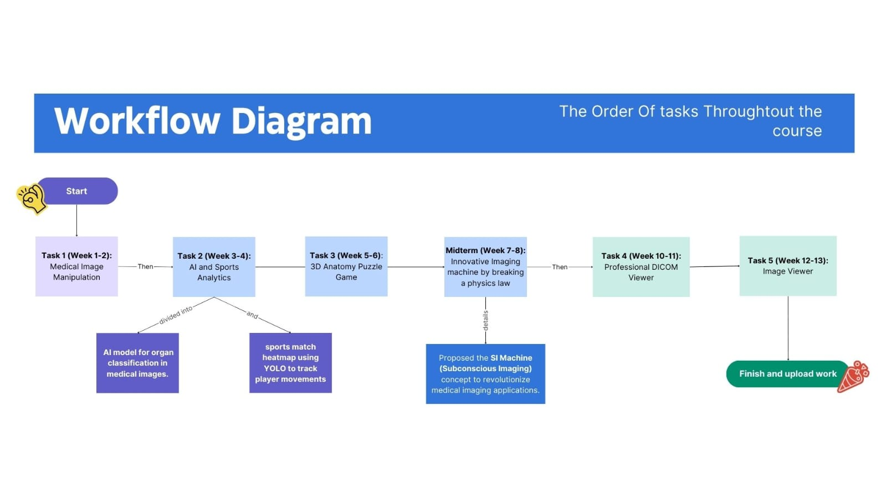

# 🩺 ImageBasedAnatomy_Tasks
Faculty of Engineering, Cairo University
Department of Systems and Biomedical Engineering

This repository contains a collection of tasks completed as part of the course "Introduction to Imaging and Image-Based Anatomy". Each task explores a unique aspect of imaging systems and medical image analysis, demonstrating both foundational understanding and innovative applications.

---

## 📁 Repository Overview

This repository contains five project tasks that explore concepts related to imaging and anatomy. Each task is organized in a dedicated folder for clarity and accessibility.

1. ### **Task 1: MultiPlanar Reconstruction (MPR)**  
- **Objective**: Reconstruct medical images in different planes (axial, sagittal, and coronal).  
- **Features**:  
  - Interactive slicing through medical image stacks.  
  - Visual representation of anatomical structures across different planes.
     
2. ### **Task 2: AI on Images**  
- **Subtask 1**: **Organ Classification in Medical Images**  
  - Developed a machine learning model to classify main organs (heart, brain, liver, limbs).    
- **Subtask 2**: **Football Player Tracking & Heatmap Analysis**  
  - Applied pretrained YOLO AI for player tracking in match videos.  
  - Generated movement heatmaps for individual players.
    
3. ### **Task 3: 3D Anatomy Organs Puzzle**  
   **Objective**: Create an interactive puzzle for assembling 3D anatomical organ models.  
- **Features**:  
  - Engaging and educational tool for learning anatomy.  
  - Real-time feedback on correct placements. 

4. ### **Task 4. SI Machine**  
- **Objective**: Propose a revolutionary idea that breaks one of the established laws of physics to transform medical imaging.  
- **Task**:  
  - Developed the concept of **Subconscious Imaging** by creatively "breaking" Newton's First Law of Motion to visualize subconscious brain activity.  
  - **Key Features**:  
    - Manipulation of light to bend, pause, and trace neural pathways.  
    - Application of technologies such as entangled photons, multiphoton microscopy, and gradient-index (GRIN) lenses.  
    - Proposed transformative applications in mental health diagnostics, memory recovery, and dream visualization.  
  - Deliverables included:  
    - A **one-page professional proposal**.  
    - A **2-minute demonstration video**.
     
5. ### **Task 5: DICOM Viewer**  
   **Objective**: Develop a professional-grade viewer for DICOM files.  
- **Features**:  
  - Supports 2D, M2D, and 3D image visualization.  
  - User-friendly interface inspired by professional tools like RadiAnt and MicroDicom.
    
6. ### **Task 6: Image Viewer**  
   **Objective**: Create a tool to view and manipulate medical images.  
- **Features**:  
  - Zooming and panning capabilities.  
  - Contrast enhancement using CLAHE. 

---

## 📅 Tasks Workflow and Timelines

 The following diagram outlines the workflow and timeline for completing the tasks in this course:

---

## 🛠️ Technologies Used

- **Programming Languages:**  
  Python, C#.

- **Frameworks and Libraries:**  
  Pydicom, Numpy, TensorFlow, PyTorch, OpenCV, ITK/VTK...etc

- **Tools:**  
  YOLO, DICOM libraries, 3D visualization tools...etc

---

## 📖 About the Course

- **Course Title:** Introduction to Imaging and Image-Based Anatomy  
- **Institution:** Faculty of Engineering, Cairo University  
- **Department:** Systems and Biomedical Engineering 
- **Supervised By:** Prof. [Tamer Basha] & Prof. [Aliaa Rehan] 
 
This course introduces key concepts in imaging and its application to anatomical studies, providing hands-on experience through project-based learning.

---

## 👥 Team Members

- **Abdullah Gamil**  
- **Mohamed Badawy**  
- **Rowaida Mohamed**  
- **Yomna Sabry**

  ---

## 📬 Contact  
For questions or collaborations, feel free to reach out to any of the team members:

- **👤 [Abdullah Gamil|LinkedIn](https://www.linkedin.com/in/abdullah-gamil05?lipi=urn%3Ali%3Apage%3Ad_flagship3_profile_view_base_contact_details%3BVsr5sdzWRAG%2FPP5%2B2pmG%2Bg%3D%3D)**     
- **👤 [Mohamed Badawy|LinkedIn](https://www.linkedin.com/in/mohamed-badawy-843440316?lipi=urn%3Ali%3Apage%3Ad_flagship3_profile_view_base_contact_details%3BsRbvtQMySney%2Fop38P5skQ%3D%3D)**  
- **👤 [Rowaida Mohamed|LinkedIn](https://www.linkedin.com/in/rowida-mohamed-262a8130a?lipi=urn%3Ali%3Apage%3Ad_flagship3_profile_view_base_contact_details%3BGGuoAuQ9S9iZg3V5cbZSdw%3D%3D)**  
- **👤 [Yomna Sabry|LinkedIn](https://www.linkedin.com/in/yomna-sabry-96037b201/)**  

  
